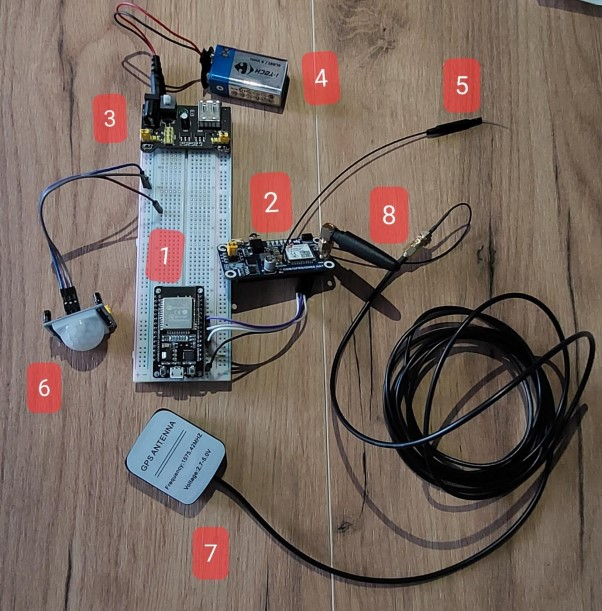

# Car Protector App
### [refactor ongoing]
Application that gives you the opportunity to monitor your vehicle parameters from your laptop in case it’s stolen or you’re worried your kid is taking it too far.

The user is able to access a website that displays received information regarding current vehicle speed, fuel level in tank, time elapsed since the vehicle started (if it’s running at the moment) as well as its location. The user can also set limits to their vehicle, so that if it's active during prohibited hours or goes beyond the specified coordinates, the user will receive an SMS with a warning.

This is the backend part of the project, so here you can check out the code used to control ESP32 module that was written in C++ using ESP-IDF framework. Data received from SAE J1939 vehicle bus through OBDII interface + data received from GPS module + data from motion sensor are handled by microcontroller, which is then sending necessary information through WiFi or GPRS to the user.

You can see how the whole device looks like and how it works (in real time) here: [youtube link](https://www.youtube.com/watch?v=i5NljPKVwE0)

Here's a photo of the connected system:

1. ESP32
2. GSM/GNSS/Bluetooth Waveshare module
3. Voltage regulator 3,3V / 5V
4. Battery 9V
5. Bluetooth antenna
6. Motion sensor
7. GPS antenna
8. GSM antenna

## What next?
- secure network connection - HTTP used currently - another module needed
- add a box to accomodate all the wires and modules & to hide the device
- code optimization
- handle many users and many vehicles